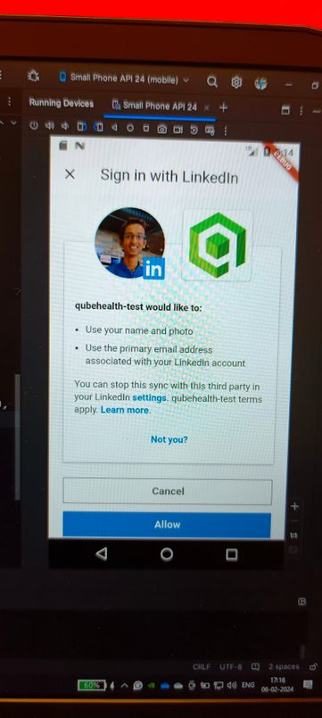
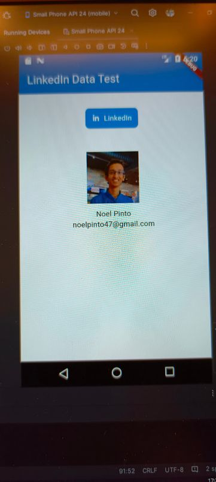

# Integrating LinkedIn with Flutter
---

### Introduction:

Integrating LinkedIn into a Flutter app offers valuable opportunities for accessing user data and enhancing professional networking experiences. By allowing users to sign in with their LinkedIn credentials, developers can collect essential profile information such as work history, skills, and connections. Additionally, leveraging web scraping techniques within the integration can further enrich the data pool, providing insights into industry trends, job postings, and more.

### Two methods for integrating LinkedIn:
1. Using LinkedIn API's
2. Webscraping using Python and Selenium

## 1. Using LinkedIn API
---
**Steps:**
1. Create a Flutter project and this Flutter package to the pubspec dependecies (pubspec.yaml) : 
[signin_with_linkedin flutter package](https://pub.dev/packages/signin_with_linkedin)
2. The sample code for connecting Flutter with LinkedIn API can be found here:
[Sample Code](https://pub.dev/packages/signin_with_linkedin/example)
3. Create a LinkedIn app by adding credentials to get the the Client ID, Client SECRET and Redirect URL to add to the sample code. LinkedIn app can be created using the link below:
[LinkedIn App](https://www.linkedin.com/developers/apps)
4. Add the credentials to the sample code and run the app.

Code for the Flutter App is as follows:
#### main.dart :
    import 'dart:developer';
    import 'package:flutter/material.dart';
    import 'package:line_icons/line_icons.dart';
    import 'package:signin_with_linkedin/signin_with_linkedin.dart';
    
    class MyHomePage extends StatefulWidget {
    const MyHomePage({super.key, required this.title});
    
    final String title;
    
    @override
    State<MyHomePage> createState() => _MyHomePageState();
    }
    
      
    
    class _MyHomePageState extends State<MyHomePage> {
    
    final String redirectUrl = 'http://127.0.0.1:8000/auth/linkedin/callback';
    final String clientId = '####';
    final String clientSecret = '####';
      
    // Modify the "scope" below as per your need
    final _linkedInConfig = LinkedInConfig(
    clientId: '77pvq2bjwvlqxv',
    clientSecret: 'n2qt7qqR1RUfg869',
    redirectUrl: 'http://127.0.0.1:8000/auth/linkedin/callback',
    scope: ['openid', 'profile', 'email'],
    );
    
    LinkedInUser? _linkedInUser;
    
    @override
    Widget build(BuildContext context) {

    return Scaffold(
      appBar: AppBar(
        backgroundColor: Theme.of(context).colorScheme.primary,
        title: Text(widget.title, style: const TextStyle(color: Colors.white),),
      ),
      body: Column(
        children: [
          SizedBox(
            height: 100,
            width: 400,
            child: Center(
                  child: InkWell(
                    splashColor: Colors.transparent,
                    highlightColor: Colors.transparent,
                    onTap: (){
                      log("clicked");
                      SignInWithLinkedIn.signIn(
                        context,
                        config: _linkedInConfig,
                        onGetAuthToken: (data) {
                          log('Auth token data: ${data.toJson()}');
                        },
                        onGetUserProfile: (accessToken, user) {
                          log('LinkedIn User: ${user.toJson()}');
                          setState(() => _linkedInUser = user);
                        },
                        onSignInError: (error) {
                          log('Error on sign in: $error');
                        },
                      );
                    },
                    child: Chip(
                      elevation: 1,
                      shadowColor: const  Color(0xff003c50),
                      label: const Text('LinkedIn', style: TextStyle(color: Colors.white),),
                      avatar: const Icon(
                        LineIcons.linkedinIn,
                        color: Colors.white,
                      ),
                      backgroundColor: const  Color(0xff0077B5),
                      shape: RoundedRectangleBorder(borderRadius: BorderRadius.circular(8.0)),
                      labelPadding: const EdgeInsets.symmetric(  horizontal: 4.0, vertical: 2.0),
                      side: BorderSide.none,
                    ),
                  ),
                ),
          ),
          const SizedBox(height: 16),
          if (_linkedInUser != null)
            SizedBox(
              height: 200,
              width: 400,
              child: Column(
                children: [
                  if (_linkedInUser!.picture != null)
                    Image.network(_linkedInUser!.picture!, width: 100, height: 100,),
                  const SizedBox(height: 10),
                  Text(_linkedInUser!.name ?? ''),
                  Text(_linkedInUser!.email ?? ''),
                ],
              ),
            ),
          SizedBox(
            height: 100,
            width: 400,
            child: Center(
              child: InkWell(
                splashColor: Colors.transparent,
                highlightColor: Colors.transparent,
                onTap: () async {
                  log("clicked");
                  await SignInWithLinkedIn.logout();
                  setState(() => _linkedInUser = null);
                },
                child: Chip(
                  elevation: 1,
                  shadowColor: const  Color(0xff003c50),
                  label: Text(_linkedInUser != null ? 'Sign Out' : 'Sign In', style: const TextStyle(color: Colors.white),),
                  backgroundColor: const  Color(0xff0077B5),
                  shape: RoundedRectangleBorder(borderRadius: BorderRadius.circular(8.0)),
                  labelPadding: const EdgeInsets.symmetric(  horizontal: 8.0, vertical: 2.0),
                  side: BorderSide.none,
                ),
              ),
            ),
          ),
        ],
      ),
    );
  }
}

 
 
**Output:**

 

## 2. Webscraping using Python and Selenium
---
**Steps:**
1. Install the required modules:
    - pandas
    - requests
    - BeautifulSoup (bs4)
    - parsel
    - selenium
    
2. Use the python code as follows:

    <pre>
    driver = webdriver.Chrome(options=opts)

    # function to ensure all key data fields have a value
    def validate_field(field):
        # if field is present pass if field:
        if field:
            pass
            # if field is not present print text else:
        else:
            field = 'No results'
        return field

    # driver.get method() will navigate to a page given by the URL address
    driver.get('https://www.linkedin.com/in/.../')
    sleep(2)

    # Find the sign-in modal
    modal = driver.find_element(By.XPATH, '//*[@id="public_profile_contextual-sign-in"]/div/section/div/div/div/div[1]/button')
    modal.click()
    # sleep for 0.5 seconds
    sleep(0.5)
    #locate email form by_class_name
    username = driver.find_element(By.XPATH, '//*[@id="public_profile_contextual-sign-in_sign-in-modal_session_key"]')
    # send keys(0) to simulate keystrokes
    username.send_keys ("...")
    # sleep for 0.5 seconds
    sleep(0.5)
    # locate password form by_class_name
    password = driver.find_element(By.XPATH, '//*[@id="public_profile_contextual-sign-in_sign-in-modal_session_password"]')
    # send keys() to simulate key strokes
    password.send_keys('...')
    sleep(0.5)
    # locate submit button by xpath
    sign_in_button = driver.find_element(By.XPATH,'//*[@id="public_profile_contextual-sign-in_sign-in-modal"]/div/section/div/div/form/div[2]/button')
    # . click() to mimic button click
    sign_in_button.click()
    sleep(2)

    # Find the element containing the experience data
    experience_data = driver.find_element(By.XPATH, '//*[@id="profile-content"]/div/div[2]/div/div/main/section[5]/div[3]/ul')

    # Find the specific element containing the job title
    job_title_element = experience_data.find_element(By.XPATH, './/span[contains(@aria-hidden, "true")]')
    company_element = experience_data.find_elements(By.XPATH, './/span[contains(@aria-hidden, "true")]')[1]

    # Get the text of the job title element
    job_title = job_title_element.text
    job_company = company_element.text

    print(job_title + "\n" + job_company)
    </pre>

Output:  
*Trainee Noel Pinto - Qubehealth*
 
## Conclusion
---
In summary, integrating LinkedIn into Flutter apps allows access to valuable user data and enhances professional networking experiences. By enabling users to sign in with their LinkedIn credentials, developers can gather essential profile information. Additionally, leveraging web scraping techniques enriches data insights, offering industry trends and job postings. This combined approach enhances user engagement and satisfaction, offering personalized experiences based on professional interests.