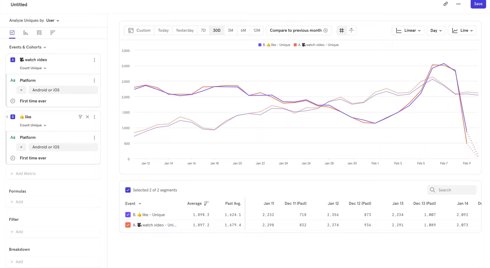
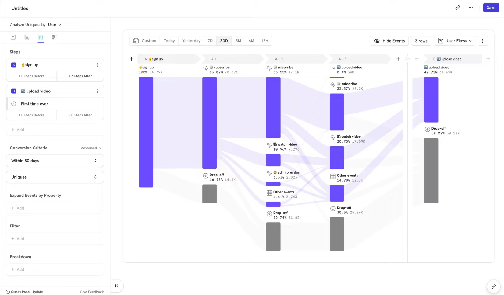

# Mixpanel
--- 

Mixpanel is a business analytics tool that focuses on helping businesses understand user behavior and make data-driven decisions. Mixpanel integration refers to the process of connecting Mixpanel with other software applications or platforms to exchange data and enhance the analytical capabilities of the integrated systems.

Here are some key aspects of Mixpanel integration:

1. **Data Tracking:** Mixpanel helps businesses track user interactions and events within their applications or websites. Integration involves setting up tracking codes or SDKs (Software Development Kits) to capture relevant data points, such as user actions, clicks, and conversions.

2. **Event Tracking:** Events are specific user interactions within an application or website that businesses want to analyze. Integration allows businesses to define and track custom events, helping them understand how users engage with their product.

3. **User Analytics:** Mixpanel integration enables businesses to analyze user behavior, such as user demographics, retention rates, and the paths users take within an application. This information can be crucial for making informed decisions about product development, marketing strategies, and user experience improvements.

4. **A/B Testing:** A/B testing involves comparing two versions of a web page or app to determine which one performs better. Mixpanel integration allows businesses to set up and analyze A/B tests to optimize user experience and achieve better conversion rates.

5. **User Segmentation:** Integration with Mixpanel enables businesses to segment their user base based on various criteria, such as geographic location, device type, or user behavior. This segmentation helps businesses target specific user groups with personalized marketing messages or product updates.

6. **Retention Analysis:** Mixpanel allows businesses to analyze user retention over time. By integrating Mixpanel with their systems, businesses can gain insights into how well they retain users and identify factors that contribute to user churn.

7. **Integration with Other Tools:** Mixpanel can be integrated with other analytics tools, customer relationship management (CRM) systems, and marketing automation platforms. This integration helps create a unified data ecosystem, allowing businesses to leverage data from multiple sources for comprehensive insights.

To integrate Mixpanel, developers typically follow the integration documentation provided by Mixpanel, which includes instructions on setting up tracking codes, configuring events, and accessing analytics data. 

> The goal is to seamlessly incorporate Mixpanel into existing workflows to extract valuable insights for business growth and improvement.

---

## Analysis Reports:
- **Insights:**
Explore your data  by segmenting and filtering events and user counts.

- **Funnels:**
Understand the conversion and drop-off of critical sequences by measuring user progress at each step

- **Flows:**
Analyze how users move through your product by exploring paths between any actions

- **Retention:**
Assess stickiness of your product by measuring how much users come back over time

---

## Tools:
1. **Dashboards** -
Properties help you segment your data

2. **Data Model**
Mixpanel is event centric and optimized for very large sets of data.
Events can contain any number of custom dimension or properties.

3. **Insights**
This is the query builder for generating charts based on aggregate and unique functions on a column.

4. **Charts**

5. **Segmentation**

6. **Funnels**

7. **Flows**

8. **Retention**

----
