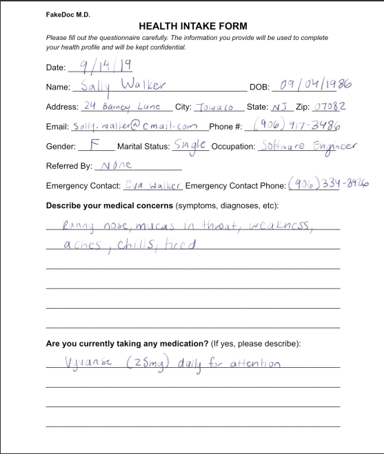
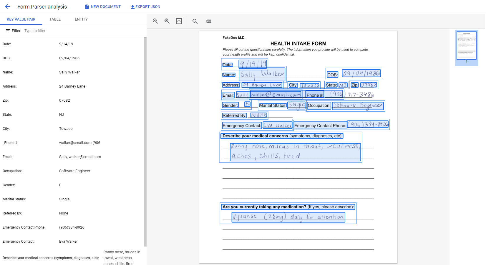

# PDF Reader with Python and Google's AI
---


**Introduction:**
In today's digital age, extracting text from PDF documents is a common task in various fields such as data analysis, natural language processing, and document management. In this article, we will explore how to extract text from PDF documents using Python, leveraging popular libraries such as `pdf2image`, `pytesseract`, `opencv`, and `docx` and also other methods such Google Document AI provided by Vertex AI to extract data from images.

## 1. Extracting Text from PDF Documents using Python
---

**Step 1: Installing Required Libraries:**
Before we begin, ensure you have the necessary libraries installed. You can install them using `pip`:

```bash
pip install pdf2image pytesseract opencv-python docx pdfplumber
```

**Step 2: Converting PDF to Images:**
First, we need to convert the PDF pages into images to process them effectively. We'll use the `pdf2image` library to accomplish this task:

```python
from pdf2image import convert_from_path

pdf_path = '.\pdfs\OG-24-1919-8403-00000181 BC.pdf'
images = convert_from_path(pdf_path)
```

**Step 3: Extracting Text from Images:**
Next, we'll iterate through each page/image, preprocess it, and use Tesseract OCR to extract text:

```python
from pdf2image import convert_from_path
import cv2
import pytesseract
import numpy as np

# Path to the PDF file
pdf_path = '.\pdfs\OG-24-1919-8403-00000181 BC.pdf'

# Convert PDF to images
images = convert_from_path(pdf_path)

text = ""

# Iterate through each page/image
for idx, image in enumerate(images):
    # Convert image to OpenCV format
    image_np = cv2.cvtColor(np.array(image), cv2.COLOR_RGB2BGR)
    
    # Preprocess the image (e.g., convert to grayscale, apply thresholding)
    gray_image = cv2.cvtColor(image_np, cv2.COLOR_BGR2GRAY)
    thresholded_image = cv2.threshold(gray_image, 0, 255, cv2.THRESH_BINARY | cv2.THRESH_OTSU)[1]
    
    # Perform OCR on the preprocessed image
    extracted_text = pytesseract.image_to_string(thresholded_image)
    
    # Output extracted text for each page
    text += f"\nExtracted Text from Page {idx+1}:"
    text+= f"\n\n{extracted_text}"
    print(f"Extracted Text from Page {idx+1}:")
    print(extracted_text)


# Save extracted text to a Word document
doc = Document()
doc.add_paragraph(text)
doc.save('docs/extracted_text.docx')
```

**Step 4: Saving Extracted Text to a Word Document:**
Finally, we'll save the extracted text to a Word document using the `docx` library:

```python
from docx import Document

doc = Document()
doc.add_paragraph(extracted_text)
doc.save('extracted_text.docx')
```

### Output:
Accuracy: 89.91258741258741 <br><br>

## 2. Extracting Text from PDF Documents using Google Document AI
---
**Steps:**
1. Create a google cloud project at Google Cloud Platform
2. Enable billing for the project
3. The documentation for Document AI can be found at : 
[Google Document AI](https://cloud.google.com/document-ai/docs/process-documents-form-parser)
<br>

There are different types of processors made available by Google for text detection:
- **OCR Processor** is a basic processor used to detect just handwritten text without any formatted data such as tables, etc.
- **Form Parser** is a bit advanced processer as it also detection of text withing tables with proper formatting and converts it to key value pairs.
<br>
<br>

#### Sample Input:  
<br>


<br>

#### Sample Output: 
<br>


#### Extracted JSON:
```
{
  "uri": "",
  "mimeType": "application/pdf",
  "text": "FakeDoc M.D.\nHEALTH INTAKE FORM\n
  Please fill out the questionnaire carefully. The information you provide will be used to complete\n
  your health profile and will be kept confidential.\nDate:\n9/14/19\nName:\nSally Walker\n
  DOB: 09/04/1986\nAddress: 24 Barney Lane\nCity: Towaco\nState: NJ Zip: 07082\nEmail: Sally, walker@cmail.com\n_Phone #: (906) 917-3486\nGender: F\nMarital Status:\nSingle Occupation: Software Engineer\n
  Referred By: None\nEmergency Contact: Eva Walker Emergency Contact Phone: (906)334-8926\n
  Describe your medical concerns (symptoms, diagnoses, etc):\nRanny nose, mucas in thwat, weakness,\n
  aches, chills, tired\nAre you currently taking any medication? (If yes, please describe):\n
  Vyvanse (25mg) daily for attention.\n",
  "pages": [{
    "pageNumber": 1,
    "dimension": {
      "width": 1845.0,
      "height": 2167.0,
      "unit": "pixels"
    },
  }]
}
```


## Conclusion:
---
In this article, we've demonstrated how to extract text from PDF documents using Python. 
-   By leveraging libraries such as `pdf2image`, `pytesseract`, and `docx`, we can efficiently process PDF files and extract text for further analysis or document management purposes. 
-   Using Google's Document AI, we obtain a very highly accurate extracted text with proper key value pairs being made.
