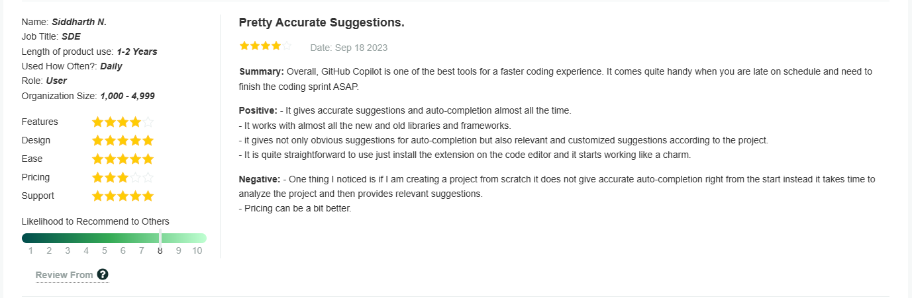

# GitHub Copilot Research Summary
---

[A visual presentation can be found here.](https://prezi.com/view/AuTSTUBcxB5q55S2Olpy/)

## Key Features and Capabilities:
- **Code Suggestions:** GitHub Copilot suggests entire lines or blocks of code as developers type, reducing manual coding efforts.
- **Multilingual Support:** Capable of generating code in multiple programming languages, accommodating diverse development scenarios.
- **Context Awareness:** Understands and adapts to the context of the code being written, providing accurate and relevant suggestions.
- **Code Comment Generation:** Assists in generating comments to explain the purpose and functionality of the code.

## Impact on Developer Workflows:
- **Increased Productivity:** Accelerates the coding process, allowing developers to focus on higher-level logic and problem-solving.
- **Code Quality:** Considers best practices, contributing to the overall improvement of code quality.
- **Learning Aid:** Acts as an educational tool by showcasing different coding approaches and patterns.

## GitHub Copilot vs. CodeGPT:
1. **Purpose:**
   - GitHub Copilot: Code assistance during development.
   - CodeGPT: Generalized language model with code generation capabilities.

2. **Integration:**
   - GitHub Copilot: Direct integration into popular code editors.
   - CodeGPT: Accessed through API calls, not directly integrated into code editors.

3. **Code Generation:**
   - GitHub Copilot: Focuses on generating code snippets with context awareness.
   - CodeGPT: Generates code as part of its broader capability in natural language tasks.

4. **Training Data:**
   - GitHub Copilot: Trained on public code repositories for coding context.
   - CodeGPT: Trained on diverse data, lacking specific coding focus.

5. **Use Cases:**
   - GitHub Copilot: Coding assistance.
   - CodeGPT: Versatile, suitable for various natural language tasks.

6. **Context Awareness:**
   - GitHub Copilot: High context awareness within coding environments.
   - CodeGPT: Understands context but may not be as finely tuned for code-specific contexts.

7. **Accessibility:**
   - GitHub Copilot: Directly accessible within code editors.
   - CodeGPT: Accessed through API calls, suitable for custom applications.

## Reviews

## GitHub Copilot Plans and Pricing:
- **Platforms Supported:** Windows, Mac, Linux.
- **Integrations:** GitHub, Visual Studio Code, Go, Cursor, IntelliSense, JSON.
- **Supports Code Completion.**
- **Free Trial:** 30-day free trial.
- **Monthly Plan:** $10/month.
- **Yearly Plan:** $100/year.

## Other Alternatives to GitHub Copilot:
1. **TabNine:**
   - Code Completion, Integrations, AI Model.

2. **Blackbox AI**
   - Supports Code Completion,  Large Language Models

## Conclusion:
GitHub Copilot is a powerful tool for code assistance, enhancing productivity and code quality. Its contextual understanding and direct integration into code editors set it apart. While CodeGPT is versatile, it lacks the specialized focus on coding assistance. Users can choose plans based on their needs, and alternatives like TabNine and Kite offer additional options in the AI-powered code completion space.

## References
[GitHub Copilot Pricing](https://github.com/github-copilot/signup)  
